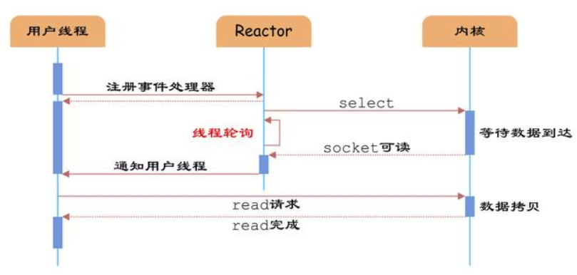
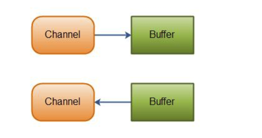
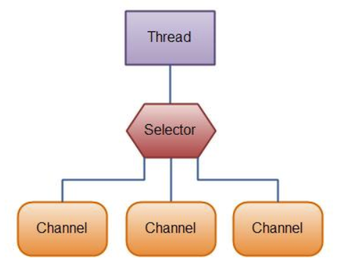
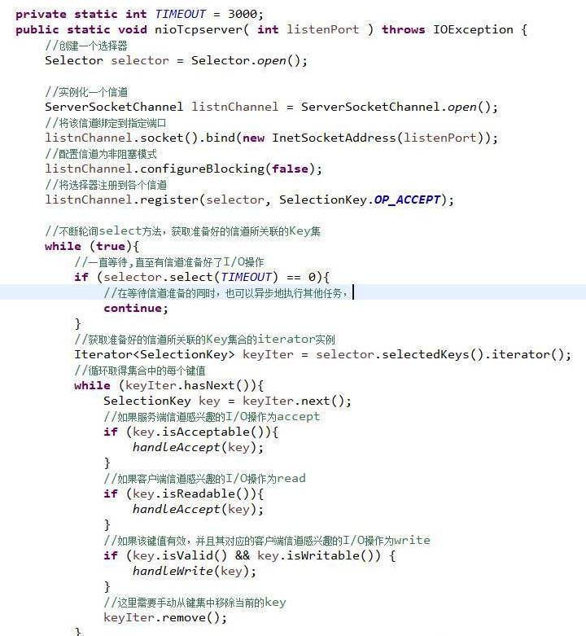

## IO
> 在计算机系统中I/O就是输入（Input）和输出(Output)的意思，针对不同的操作对象，可以划分为磁盘I/O模型，网络I/O模型，
>内存映射I/O, Direct I/O、数据库I/O等，只要具有输入输出类型的交互系统都可以认为是I/O系统，也可以说I/O是整个操作系统数据交换
>与人机交互的通道，这个概念与选用的开发语言没有关系，是一个通用的概念

在如今的系统中I/O却拥有很重要的位置，现在系统都有可能处理大量文件，大量数据库操作，而这些操作都依赖于系统的I/O性能，
也就造成了现在系统的瓶颈往往都是由于I/O性能造成的。因此，为了解决磁盘I/O性能慢的问题，系统架构中添加了缓存来提高响应速度；
或者有些高端服务器从硬件级入手，使用了固态硬盘（SSD）来替换传统机械硬盘；在大数据方面，Spark越来越多的承担了实时性计算任务，
而传统的Hadoop体系则大多应用在了离线计算与大量数据存储的场景，这也是由于磁盘I/O性能远不如内存I/O性能而造成的格局（Spark更多的使用了内存，
而MapReduece更多的使用了磁盘）。因此，**一个系统的优化空间，往往都在低效率的I/O环节上**，很少看到一个系统CPU、内存的性能是其整个系统
的瓶颈。也正因为如此，Java在I/O上也一直在做持续的优化，从**JDK 1.4**开始便引入了NIO模型，大大的提高了以往BIO模型下的操作效率。


## IO 模型

- BIO(Blocking I/O）:
    同步阻塞I/O模式，数据的读取写入必须阻塞在一个线程内等待其完成。这里使用那个经典的烧开水例子，这里假设一个烧开水的场景，
    有一排水壶在烧开水，BIO的工作模式就是， 叫一个线程停留在一个水壶那，直到这个水壶烧开，才去处理下一个水壶。
    但是实际上线程在等待水壶烧开的时间段什么都没有做。

- NIO（New I/O）：
    同时支持阻塞与非阻塞模式，但这里我们以其同步非阻塞I/O模式来说明，那么什么叫做同步非阻塞？如果还拿烧开水来说，**NIO的做法是叫一个线程
    不断的轮询每个水壶的状态**，看看是否有水壶的状态发生了改变，从而进行下一步的操作。
    
- AIO（Asynchronous I/O）：
    异步非阻塞I/O模型。异步非阻塞与同步非阻塞的区别在哪里？异步非阻塞无需一个线程去轮询所有IO操作的状态改变，在相应的状态改变后，
    系统会通知对应的线程来处理。对应到烧开水中就是，为每个水壶上面装了一个开关，水烧开之后，水壶会自动通知我水烧开了。


进程中的IO调用步骤大致可以分为以下四步： 

1. 进程向OS操作系统请求数据 ;

2. 操作系统把外部数据加载到内核的缓冲区中; 

3. 操作系统把内核的缓冲区拷贝到进程的缓冲区 ;

4. 进程获得数据完成自己的功能 ;

当操作系统在把外部数据放到进程缓冲区的这段时间（即上述的第二，三步）[read/write]，如果应用进程是挂起等待的，那么就是同步IO，反之，就是异步IO，也就是AIO 。


### BIO

> 阻塞; 面向流

 典型应用: apache tomcat
 
 场景: 适用于连接数小(并发量要求不高),且一次发送大量数据的场景,这种方式对于服务器资源要求比较高,并发局限于应用中。
 


### NIO (New I/O) 同步非阻塞I/O
> 非阻塞; 面向缓存区(通道Channel); IO多路复用

  典型应用: Nginx, Netty, Jetty, Mina, Zookeeper
  
  场景: 适用于处理连接数特别多(高并发场景),但是连接比较短(轻操作)的场景,服务器需要支持**超大量的长时间连接**。比如1万+个连接,并且客户端
  **不会频繁地发送太多数据**


关于NIO，国内有很多技术博客将英文翻译成No-Blocking I/O，非阻塞I/O模型 ，当然这样就与BIO形成了鲜明的特性对比。
NIO本身是**基于事件驱动**的思想来实现的，其目的就是解决BIO的大并发问题，在BIO模型中，如果需要并发处理多个I/O请求，那就需要多线程来支持，
NIO使用了**多路复用器机制**，以socket使用来说，**多路复用器通过不断轮询各个连接的状态**，只有在socket有流可读或者可写时，应用程序才需要去处理它，
在线程的使用上，就不需要一个连接就必须使用一个处理线程了，而是只是**有效请求**时（确实需要进行I/O处理时），才会使用一个线程去处理，
这样就避免了BIO模型下大量线程处于阻塞等待状态的情景。

相对于BIO的流，NIO抽象出了新的通道（Channel）作为输入输出的通道，并且提供了缓存（Buffer）的支持，在进行读操作时，需要使用Buffer分配空间，
然后将数据从Channel中读入Buffer中，对于Channel的写操作，也需要现将数据写入Buffer，然后将Buffer写入Channel中。

如下NIO对文件的拷贝
```java
    public static void copyFile (String srcFileName, String dstFileName) throws IOException {
        FileInputStream fis = new FileInputStream(srcFileName);
        FileOutputStream fos = new FileOutputStream(dstFileName);

        FileChannel readChannel = fis.getChannel();
        FileChannel writeChannel = fos.getChannel();

        ByteBuffer buffer = ByteBuffer.allocate(1024);

        while (true) {
            buffer.clear();
            if ( readChannel.read(buffer) == -1 ){
                break;
            }
            // 将当前位置设置为limit, 然后再将缓存区游标置于0, 0-limit写入Channel
            buffer.flip();
            writeChannel.write(buffer);
        }
        fis.close();
        fos.close();
    }

```

通过比较New IO的使用方式我们可以发现，新的IO操作不再面向 Stream来进行操作了，改为了通道Channel，并且使用了更加灵活的缓存区类Buffer，
Buffer只是缓存区定义接口， 根据需要，我们可以选择对应类型的缓存区实现类。
在java NIO编程中，我们需要理解以下3个对象Channel、Buffer和Selector。

- Channel
首先说一下Channel，国内大多翻译成“通道”。Channel和IO中的Stream(流)是差不多一个等级的。只不过Stream是单向的，譬如：InputStream, OutputStream。
而Channel是双向的，既可以用来进行读操作，又可以用来进行写操作，NIO中的Channel的主要实现有：FileChannel、DatagramChannel、SocketChannel、ServerSocketChannel；
通过看名字就可以猜出个所以然来：分别可以对应文件IO、UDP和TCP（Server和Client）。
 
 
- Buffer
NIO中的关键Buffer实现有：ByteBuffer、CharBuffer、DoubleBuffer、 FloatBuffer、IntBuffer、 LongBuffer,、ShortBuffer，
分别对应基本数据类型: byte、char、double、 float、int、 long、 short。当然NIO中还有MappedByteBuffer, HeapByteBuffer, DirectByteBuffer等这里先不具体陈述其用法细节。
 
[说一下 DirectByteBuffer 与 HeapByteBuffer 的区别？](./DirectByteBuffer与HeapByteBuffer的区别.md)
 
- Selector
Selector 是NIO相对于BIO实现多路复用的基础，Selector 运行单线程处理多个 Channel，如果你的应用打开了多个通道，但每个连接的流量都很低，
使用 Selector 就会很方便。例如在一个聊天服务器中。要使用 Selector , 得向 Selector 注册 Channel，然后调用它的 select() 方法。
这个方法会一直阻塞到某个注册的通道有事件就绪。一旦这个方法返回，线程就可以处理这些事件，事件的例子有如新的连接进来、数据接收等。





这里我们再来看一个NIO模型下的TCP服务器的实现，我们可以看到Selector 正是NIO模型下 TCP Server 实现IO复用的关键，请仔细理解下段代码while循环中的逻辑，见下图：



### AIO    
> 异步; 多线程

从编程模式上来看AIO相对于NIO的区别在于，**NIO需要使用者线程不停的轮询IO对象，来确定是否有数据准备好可以读了，而AIO则是在数据准备好之后，才会通知数据使用者**，
这样使用者就不需要不停地轮询了。当然AIO的异步特性并不是Java实现的伪异步，而是使用了系统底层API的支持，在Unix系统下，采用了epoll IO模型，
而windows便是使用了IOCP模型。关于Java AIO，本篇只做一个抛砖引玉的介绍，如果你在实际工作中用到了，那么可以参考Netty在高并发下使用AIO的相关技术。


## 总结

BIO、NIO、AIO适用场景分析：
BIO方式适用于连接数目比较小且固定的架构，这种方式对服务器资源要求比较高
NIO方式适用于连接数目多且连接比较短的架构，可充分利用服务器资源
AIO方式使用于连接数目多且连接比较长的架构，充分调用OS参与并发操作


>总 结:
>IO实质上与线程没有太多的关系，但是不同的IO模型改变了应用程序使用线程的方式，NIO与AIO的出现解决了很多BIO无法解决的并发问题，当然任何技术抛开适用场景都是耍流氓，复杂的技术往往是为了解决简单技术无法解决的问题而设计的，在系统开发中能用常规技术解决的问题，绝不用复杂技术，否则大大增加系统代码的维护难度，学习IT技术不是为了炫技，而是要实实在在解决问题。


---

*本文参考博文地址:*     

*https://juejin.im/entry/598da7d16fb9a03c42431ed3*

*https://www.cnblogs.com/binghuaZhang/p/11042835.html*