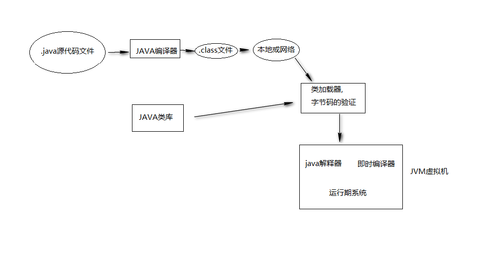
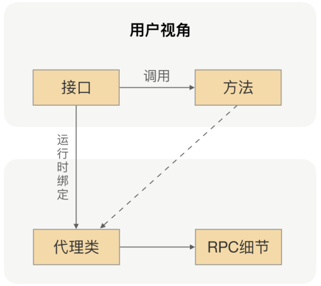

## 代理模式
  >将一个对象的直接访问,变为访问这个对象的代理对象,通过代理对象间接的访问原本的对象

  **为什么需要代理呢?**
  因为一个良好的设计不应该被轻易地修改,这正是开闭原则的体现: 一个良好的设计应该对修改关闭, 对扩展开放。
而代理正是为了扩展类的而存在的, 其可以控制对现有类服务的访问。

## 类的加载
    - 静态代理的代理类在运行前(编译期间)就生成了代理类, 不是编译器生成的代理类,而是手动创建的类
    - 动态代理的代理类并不是在java代码中定义好的,而是在运行时(运行期动态创建)根据我们在java代码中的"指示"动态生成的
    
  ClassLoader, 可以在运行期动态地载入字节码, 从而装载定义在其中的类信息(Class对象)
  
  

## 远程调用的魔法
在项目中，当我们要使用 RPC 的时候，我们一般的做法是先找服务提供方要接口，通过Maven 或者其他的工具把接口
依赖到我们项目中。我们在编写业务逻辑的时候，如果要调用提供方的接口，我们就只需要通过依赖注入的方式把接口
注入到项目中就行了，然后在代码里面直接调用接口的方法 。

我们都知道，接口里并不会包含真实的业务逻辑，业务逻辑都在服务提供方应用里，但我们
通过调用接口方法，确实拿到了想要的结果，是不是感觉有点神奇呢？想一下，在 RPC 里
面，我们是怎么完成这个魔术的。

**核心技术就是动态代理**, RPC 会自动给接口生成一个代理类，当我
们在项目中注入接口的时候，运行过程中实际绑定的是这个接口生成的代理类。这样在接口
方法被调用的时候，它实际上是被生成代理类拦截到了，这样我们就可以在生成的代理类里
面，加入远程调用逻辑。
通过这种“偷梁换柱”的手法，就可以帮用户屏蔽远程调用的细节，实现像调用本地一样地
调用远程的体验，整体流程如下图所示：

## 实现
### 1. 静态代理
   在编译期就生成代理类,实现简单,但不灵活
   
### 2. 动态代理
   增加程序的灵活性 (其主要原理是利用动态生成与装载字节码的技术,为指定的接口动态创建代理类)
   
   
   #### 2.1 基于JDK实现动态代理(基于接口实现)
   - 关键接口: InvocationHandler
   - 关键类  : Proxy.newProxyInstance
      
   InvocationHandler这个接口是被动态代理类回调的接口，我们增加的针对委托类的统一处理逻辑都增加到invoke 方法里面
   
   
   JDK动态代理的代理类字节码在创建时，需要实现业务实现类所实现的接口作为参数。如果业务实现类是没有实现接口而是直接定义业务方法的话，
   就无法使用JDK动态代理了。(JDK动态代理重要特点是代理接口) 并且，如果业务实现类中新增了接口中没有的方法，
   这些方法是无法被代理的（因为无法被调用）。
   
   动态代理只能对接口产生代理，不能对类产生代理
   
   #### 2.2 基于CGLIB实现动态代理(基于继承实现)
      - 关键接口: MethodInterceptor 

      
   Cglib是针对类来实现代理的，他的原理是对代理的目标类生成一个子类，并覆盖其中方法实现增强，因为底层是基于创建被代理类的一个子类，所以它避免了JDK动态代理类的缺陷。
   
   但因为采用的是继承，所以不能对final修饰的类进行代理。final修饰的类不可继承。
   
   CGLIB创建的动态代理对象在性能方面比JDK创建的动态代理对象要高很多,但创建代理对象所花费的时间却比JDK动态代理多得多,
   **因此,对于一次创建而多次使用的对象,用CGLIB更合适,反之,使用JDK的动态代理更合适**
 
   
 