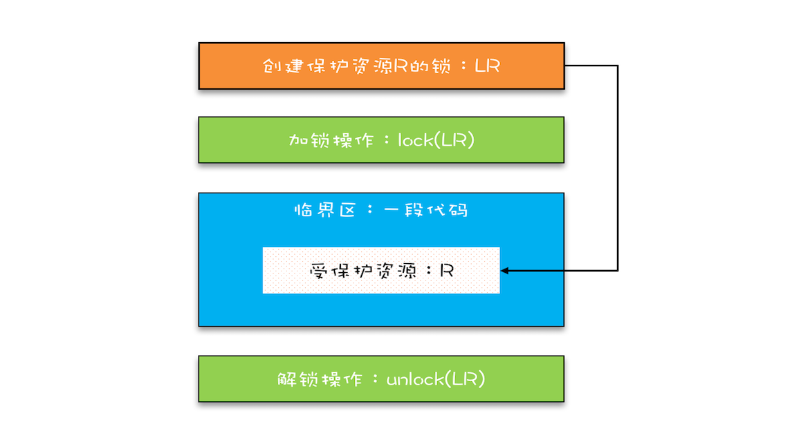
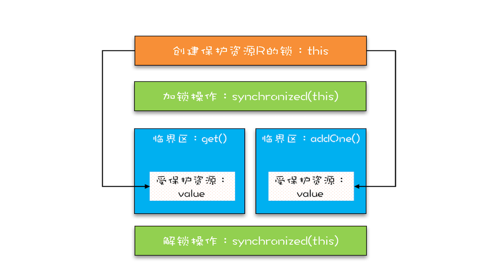

## 并发编程

> 并发编程核心矛盾一直存在, 本质在于CPU, 内存, IO设备的速度差异

为合理利用CPU的高性能, 平衡这三者的速度差异, 计算机系统, 编译程序等都做出了贡献,主要体现为:
1. CPU 增加了缓存，以均衡与内存的速度差异；
2. 操作系统增加了进程、线程，以分时复用 CPU，进而均衡 CPU 与 I/O 设备的速度差
异；
3. 编译程序优化指令执行次序，使得缓存能够得到更加合理地利用


但由此也带来很多并发的问题,要解决这些问题, 我们可以从如下几点考虑解决

 - 可见性
 - 原子性
 - 有序性
 
 
 
## 1 可见性
> 一个线程对共享变量的修改, 另一个线程能够立刻看到, 我们称为可见性

可见性主要问题,来自于当前多核时代,每个CPU都有其自己的缓存, 与内存的数据一致性的问题

多个线程在不同的CPU上运行时,这些线程操作的是不同的CPU缓存
 

## 2 原子性
 > 我们把一个或者多个操作在 CPU 执行的过程中不被中断的特性称为原子性
 
 这块主要的问题,主要来自于操作系统CPU多**线程切换**所带来的。
 
 早期的操作系统基于进程来调度 CPU，不同进程间是不共享内存空间的，所以进程要做任
 务切换就要切换内存映射地址，而一个进程创建的所有线程，都是共享一个内存空间的，所
 以线程做任务切换成本就很低了。现代的操作系统都基于更轻量的线程来调度，现在我们提
 到的“任务切换”都是指“线程切换”
 
 
 java 并发程序都是基于多线程的，自然也会涉及到任务切换，也许你想不到，任务切换竟
 然也是并发编程里诡异 Bug 的源头之一。任务切换的时机大多数是在时间片结束的时候，
 我们现在基本都使用高级语言编程，高级语言里一条语句往往需要多条 CPU 指令完成，例
 如上面代码中的count += 1，至少需要三条 CPU 指令。
 
  指令 1：首先，需要把变量 count 从内存加载到 CPU 的寄存器；
  指令 2：之后，在寄存器中执行 +1 操作；
  指令 3：最后，将结果写入内存（缓存机制导致可能写入的是 CPU 缓存而不是内存)
 
 
 操作系统做任务切换，可以发生在任何一条CPU 指令执行完，是的，是 CPU 指令，而不
 是高级语言里的一条语句。对于上面的三条指令来说，我们假设 count=0，如果线程 A 在
 指令 1 执行完后做线程切换，线程 A 和线程 B 按照下图的序列执行，那么我们会发现两个
 线程都执行了 count+=1 的操作，但是得到的结果不是我们期望的 2，而是 1。


我们潜意识里面觉得 count+=1 这个操作是一个不可分割的整体，就像一个原子一样，线
程的切换可以发生在 count+=1 之前，也可以发生在 count+=1 之后，但就是不会发生在
中间。**我们把一个或者多个操作在 CPU 执行的过程中不被中断的特性称为原子性**。CPU
能保证的原子操作是 CPU 指令级别的，而不是高级语言的操作符，这是违背我们直觉的地
方。因此，很多时候我们需要在高级语言层面保证操作的原子性。

 ### 2.1 如何解决原子性问题?
原子性问题的源头就是**线程切换**,而操作系统做线程切换时依赖CPU中断的,所以禁止CPU发生中断就能够禁止线程切换

单核时代(同一时刻只有一个线程),此方案可行,但并不适合多核场景(同一时刻多个线程同时运行,且执行在不同的CPU上)


**同一时刻只有一个线程执行**才能真正意义上保证原子性, 这个条件我们可以称之为**互斥**,保证对共享变量的修改时互斥的,
那无论单核还是多核场景都可以解决原子性问题

#### 2.1.1 简易锁模型

> 1. 加锁操作 lock(); 2.临界区:代码逻辑;  3. 解锁操作: unlock()

**临界区:** 我们把一段需要互斥执行的代码称之为临界区

如厕的例子其实就是个简易锁模型,这个事就是临界区,但很容易让我们忽略两个非常重要的点:
- 我们锁的是什么?
- 我们保护的又是什么?


#### 2.1.2 改进后的锁模型
我们知道在现实世界里，锁和锁要保护的资源是有对应关系的，比如你用你家的锁保护你家
的东西，我用我家的锁保护我家的东西。在并发编程世界里，锁和资源也应该有这个关系，
但这个关系在我们上面的模型中是没有体现的，所以我们需要完善一下我们的模型。



首先，我们要把临界区要保护的资源标注出来，如图中临界区里增加了一个元素：受保护的
资源 R；其次，我们要保护资源 R 就得为它创建一把锁 LR；最后，针对这把锁 LR，我们
还需在进出临界区时添上加锁操作和解锁操作。另外，在锁 LR 和受保护资源之间，我特地
用一条线做了关联，这个关联关系非常重要。很多并发 Bug 的出现都是因为把它忽略了，
然后就出现了类似锁自家门来保护他家资产的事情，这样的 Bug 非常不好诊断，因为潜意
识里我们认为已经正确加锁了。

### 2.2 java提供的锁技术: Synchronized
锁是一种通用的技术方案,java提供Synchronized关键字,就是锁的一种实现。
Synchronized关键字可以用来修饰方法, 也可以用来修饰代码块, 使用示例:
```java
class X {
// 修饰非静态方法
synchronized void foo() {
// 临界区
    }
// 修饰静态方法
synchronized static void bar() {
// 临界区
    }
// 修饰代码块
Object obj = new Object();
void baz() {
synchronized(obj) {
// 临界区
    }
  }
}
```
Java 编译器会在 synchronized 修饰的方法或代码块前后自动加上加锁 lock() 和解
锁 unlock()，这样做的好处就是加锁 lock() 和解锁 unlock() 一定是成对出现的
 
那么synchronized里的加锁lock()与解锁unlock()锁定的对象在哪呢?
上面的代码我们
看到只有修饰代码块的时候，锁定了一个 obj 对象，那修饰方法的时候锁定的是什么呢？
这个也是 Java 的一条隐式规则：
>当修饰静态方法的时候，锁定的是当前类的 Class 对象
>当修饰非静态方法的时候，锁定的是当前实例对象 this。

```java
class X {
// 修饰静态方法
synchronized(X.class) static void bar() {
// 临界区
    }
}

class X {
// 修饰非静态方法
synchronized(this) void foo() {
// 临界区
    }
}
```
#### 2.2.1 使用 synchronized实现读写互斥锁

```java

class SafeCalc {
    
    long value = 0L;
    
    // get()方法也要synchronized
    synchronized long get() {
    return value;
    }
    
    // addOne synchronized
    synchronized void addOne() {
    value += 1;
    }
}

```
get() 方法和 addOne() 方
法都需要访问 value 这个受保护的资源，这个资源用 this 这把锁来保护。线程要进入临界
区 get() 和 addOne()，必须先获得 this 这把锁，这样 get() 和 addOne() 也是互斥的。




这个模型更像现实世界里面球赛门票的管理，一个座位只允许一个人使用，这个座位就
是“受保护资源”，球场的入口就是 Java 类里的方法，而门票就是用来保护资源
的“锁”，Java 里的检票工作是由 synchronized 解决的。

### 2.3 锁和受保护资源的关系


## 3 有序性

源代码顺序：源代码中所指定的内存访问操作顺序。
程序顺序：我们可以理解为编译得到机器码或者解释执行的字节码（之后把两者统称为字节码）所指定的内存访问顺序。
执行顺序：内存访问在指定处理器上的实际执行顺序。
感知顺序：给定处理器感知到其他处理器内存访问的顺序。

> 指令重排序: 程序顺序与源代码顺序不一致 或者 执行顺序与程序顺序 不一致    
> 存储子系统重排序: 表现在感知顺序与执行顺序不一样


### 3.1 编译优化带来的有序性问题
Java平台包括两种编译器：
静态编译器（javac）和动态编译器（jit:just in time）。
静态编译器是将.java文件编译成.class文件（二进制文件），之后便可以解释执行。动态编译器是将.class文件编译成机器码，之后再由jvm运行。
jit主要是做性能上面的优化，如热点代码编译成本地代码，加速调用。

