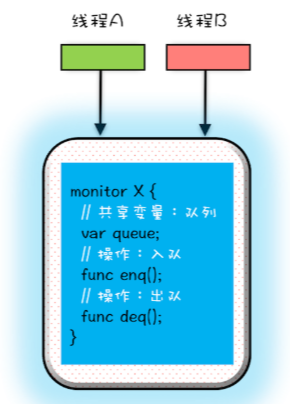
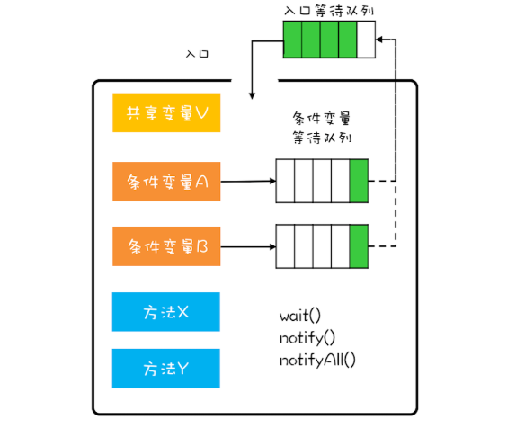

>并发问题解决的核心技术就是使用"管程"

# 1. 什么是管程 (Monitor)

java1.5 之前提供唯一并发原语就是管程
java1.5 之后提供的SDK并发包 也是以管程技术为基础的


本质: "管程"和OS的"信号量"是等价的，所谓等价指的是用管程能够实现信号量，也能用信号量实现管程


    不知道你是否曾思考过这个问题：为什么 Java 在 1.5 之前仅仅提供了 synchronized 关键字及 wait()、notify()、notifyAll() 这三个看似从天而降的方法？在刚接触 Java 的时候，
    我以为它会提供信号量这种编程原语，因为操作系统原理课程告诉我，用信号量能解决所有并发问题，结果我发现不是。后来我找到了原因：Java 采用的是管程技术，
    synchronized 关键字及 wait()、notify()、notifyAll() 这三个方法都是管程的组成部分。而管程和信号量是等价的，所谓等价指的是用管程能够实现信号量，也能用信号量实现管程。
    但是管程更容易使用，所以 Java 选择了管程。
    管程，对应的英文是 Monitor，很多 Java 领域的同学都喜欢将其翻译成“监视器”，这是直译。操作系统领域一般都翻译成“管程”，这个是意译，而我自己也更倾向于使用“管程”。
    所谓管程，指的是管理共享变量以及对共享变量的操作过程，让他们支持并发。翻译为 Java 领域的语言，就是管理类的成员变量和成员方法，让这个类是线程安全的。那管程是怎么管的呢？
    
    

# 2. 管程模型

- Hasen
- Hoare
- MESA (目前广泛使用, java观察实现也是基于此模型)

在并发编程领域，有两大核心问题：一个是**互斥**，即同一时刻只允许一个线程访问共享资源；

另一个是**同步**，即线程之间如何通信、协作。这两大问题，管程都是能够解决的。

本文重点介绍MESA模型

## 2.1 如何解决互斥问题
管程解决互斥问题的思路很简单，就是将共享变量及其对共享变量的操作统一封装起来。
在下图中，管程 X 将共享变量 queue 这个队列和相关的操作入队 enq()、出队 deq() 
都封装起来了；线程 A 和线程 B 如果想访问共享变量 queue，只能通过调用管程提供的 enq()、deq() 方法来实现；
enq()、deq() 保证互斥性，只允许一个线程进入管程。不知你有没有发现，管程模型和面向对象高度契合的。
估计这也是 Java 选择管程的原因吧。而我在前面章节介绍的互斥锁用法，其背后的模型其实就是它。



## 2.2 如何解决同步问题

MESA 模型处理:

    在管程模型里，共享变量和对共享变量的操作是被封装起来的，图中最外层的框就代表封装的意思。框的上面只有一个入口，
    并且在入口旁边还有一个入口等待队列。当多个线程同时试图进入管程内部时，只允许一个线程进入，其他线程则在入口等待队列中等待。这个过程类似就医流程的分诊，
    只允许一个患者就诊，其他患者都在门口等待。
    
    管程里还引入了条件变量的概念，而且每个条件变量都对应有一个等待队列，如下图，条件变量 A 和条件变量 B 分别都有自己的等待队列。
    



那条件变量和等待队列的作用是什么呢？其实就是解决线程同步问题。你也可以结合上面提到的入队出队例子加深一下理解。

假设有个线程 T1 执行出队操作，不过需要注意的是执行出队操作，有个前提条件，就是队列不能是空的，而队列不空这个前提条件就是管程里的条件变量。 如果线程 T1 进入管程后恰好发现队列是空的，那怎么办呢？等待啊，去哪里等呢？就去条件变量对应的等待队列里面等。此时线程 T1 就去“队列不空”这个条件变量的等待队列中等待。这个过程类似于大夫发现你要去验个血，于是给你开了个验血的单子，你呢就去验血的队伍里排队。线程 T1 进入条件变量的等待队列后，是允许其他线程进入管程的。这和你去验血的时候，医生可以给其他患者诊治，道理都是一样的。

再假设之后另外一个线程 T2 执行入队操作，入队操作执行成功之后，“队列不空”这个条件对于线程 T1 来说已经满足了，此时线程 T2 要通知 T1，告诉它需要的条件已经满足了。当线程 T1 得到通知后，会从等待队列里面出来，但是出来之后不是马上执行，而是重新进入到入口等待队列里面。这个过程类似你验血完，回来找大夫，需要重新分诊。

条件变量及其等待队列我们讲清楚了，下面再说说 wait()、notify()、notifyAll() 这三个操作。前面提到线程 T1 发现“队列不空”这个条件不满足，需要进到对应的等待队列里等待。这个过程就是通过调用 wait() 来实现的。如果我们用对象 A 代表“队列不空”这个条件，那么线程 T1 需要调用 A.wait()。同理当“队列不空”这个条件满足时，线程 T2 需要调用 A.notify() 来通知 A 等待队列中的一个线程，此时这个队列里面只有线程 T1。至于 notifyAll() 这个方法，它可以通知等待队列中的所有线程。

这里我还是来一段代码再次说明一下吧。下面的代码实现的是一个阻塞队列，阻塞队列有两个操作分别是入队和出队，这两个方法都是先获取互斥锁，类比管程模型中的入口。

1. 对于入队操作，如果队列已满，就需要等待直到队列不满，所以这里用了notFull.await();。
2. 对于出队操作，如果队列为空，就需要等待直到队列不空，所以就用了notEmpty.await();。
3. 如果入队成功，那么队列就不空了，就需要通知条件变量：队列不空notEmpty对应的等待队列。
4. 如果出队成功，那就队列就不满了，就需要通知条件变量：队列不满notFull对应的等待队列。

```java

// 条件变量及其等待队列
// await() 和前面我们提到的 wait() 语义是一样的；signal() 和前面我们提到的 notify() 语义是一样的。

public class BlockedQueue<T>{
  final Lock lock =
    new ReentrantLock();
  // 条件变量：队列不满  
  final Condition notFull =
    lock.newCondition();
  // 条件变量：队列不空  
  final Condition notEmpty =
    lock.newCondition();
 
  // 入队
  void enq(T x) {
    lock.lock();
    try {
      while (队列已满){
        // 等待队列不满 
        notFull.await();
      }  
      // 省略入队操作...
      // 入队后, 通知可出队
      notEmpty.signal();
    }finally {
      lock.unlock();
    }
  }
  // 出队
  void deq(){
    lock.lock();
    try {
      while (队列已空){
        // 等待队列不空
        notEmpty.await();
      }
      // 省略出队操作...
      // 出队后，通知可入队
      notFull.signal();
    }finally {
      lock.unlock();
    }  
  }
}
```
**await() 和前面我们提到的 wait() 语义是一样的；signal() 和前面我们提到的 notify() 语义是一样的。**