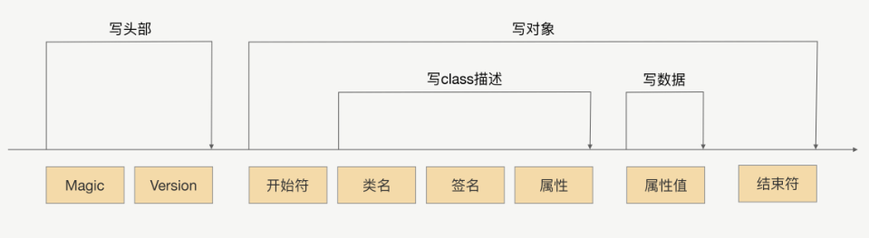
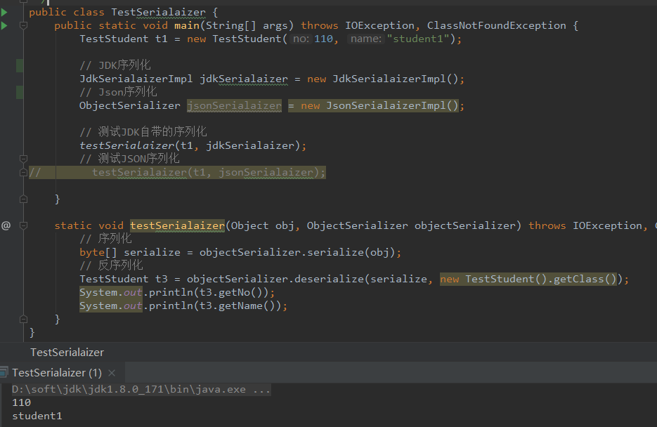
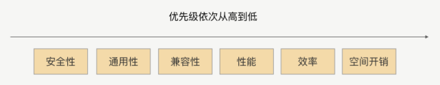

# 序列化
## 1. 为什么需要序列化

1. 网络传输的数据必须是二进制数据
2. java中的对象(网络中交互数据), 是不能直接在网络中传输

所以我们需要将需要在网络传输的对象转化为可传输的二进制, 并且这种转换算法是可逆的

**java中的序列化** 就是将一个Java对象 **"转换"** 为一串连续的bytes字节(字节数组或流),以便写入文件或通过Socket发送出去, 这一串字节包括了对象的数据(成员变量), 以及对象及其成员变量的类型信息(元信息)等,

**java的反序列化** 正好相反可以将从文件或Socket中读取到的这一串字节还原为一个几乎一模一样的Java对象


**总结来说**, 序列化就是将对象转换成二进制数据的过程，而反序列就是反过来将二进制转换
为对象的过程


## 2. 序列化在RPC中的应用

### 2.1 RPC通信流程图


不妨借用个例子帮助你理解，比如发快递，我们要发一个需要自行组装的物件。发件人发之
前，会把物件拆开装箱，这就好比序列化；这时候快递员来了，不能磕碰呀，那就要打包，
这就好比将序列化后的数据进行编码，封装成一个固定格式的协议；过了两天，收件人收到
包裹了，就会拆箱将物件拼接好，这就好比是协议解码和反序列化。


## 3. 有哪些常用的序列化框架

- JDK 原生序列化
- JSON
- Protobuf
- Thrift
- Hessian
- Kryo

> 为方便集成多种序列化, 实现多种序列化组件的插拔和替换,将序列化及反序列化抽象为[service.ObjectSerializer](src/main/java/service/ObjectSerializer.java)接口


### 3.1 JDK 原生序列化


JDK 自带的序列化机制对使用者而言是非常简单的。序列化具体的实现是由 **ObjectOutputStream** 完成的，而反序列化的具体实现是由 **ObjectInputStream** 完成的

```java
@Data
public class Student implements Serializable {
    /**
     * serialVersionUID
     * 反序列化时,会根据serialVersionUID这个常量值来判断反序列得到的类信息是否与原来一致
     * 如果我们不指定serialVersionUID值,序列化将会把当前类的hashCode值赋给它
     *
     */
    private static final long serialVersionUID = 3L;
    private int no;
    private String name;

    public static void main(String[] args) throws IOException, ClassNotFoundExc
    String home = System.getProperty("user.home");
    String basePath = home + "/Desktop";
    FileOutputStream fos = new FileOutputStream(basePath + "student.dat");
    Student student = new Student();
    student.setNo(100);
    student.setName("TEST_STUDENT");
    ObjectOutputStream oos = new ObjectOutputStream(fos);
    oos.writeObject(student);
    oos.flush();
    oos.close();
    FileInputStream fis = new FileInputStream(basePath + "student.dat");
    ObjectInputStream ois = new ObjectInputStream(fis);
    Student deStudent = (Student) ois.readObject();
    ois.close();
    System.out.println(deStudent);
    }
}
```

**JDK序列化的过程:**



序列化过程就是在读取对象数据的时候，不断加入一些特殊分隔符，这些特殊分隔符用于在反序列化过程中截断用。

- 头部数据用来声明序列化协议、序列化版本，用于高低版本向后兼容

- 对象数据主要包括类名、签名、属性名、属性类型及属性值，当然还有开头结尾等数据，除了属性值属于真正的对象值，其他都是为了反序列化用的元数据

- 存在对象引用、继承的情况下，就是递归遍历“写对象”逻辑

**封装JDK序列化实现代码:**

[JdkSerialaizerImpl](./src/main/java/impl/JdkSerialaizerImpl.java)

**测试**



### 3.2 JSON

JSON 是典型的 Key-Value 方式，没有数据类型，是一种文本型序列化框架

JSON使用广泛,无论WEB,存储,还是基于HTTP协议的RPC框架通信, 都会选择JSON格式

使用JSON进行序列化有两个问题需要注意:

- JSON 进行序列化的额外空间开销比较大，对于大数据量服务这意味着需要巨大的内存和磁盘开销；
- JSON 没有类型，但像 Java 这种强类型语言，需要通过反射统一解决，所以性能不会太好。

**所以如果 RPC 框架选用 JSON 序列化，服务提供者与服务调用者之间传输的数据量要相对
较小，否则将严重影响性能。**

```java
    public byte[] serialize(Object obj) throws IOException {
        return JSON.toJSONBytes(obj);
    }

    public <T> T deserialize(byte[] bytes, Class<T> clazz) throws IOException, ClassNotFoundException {
        return JSON.parseObject(bytes, clazz);
    }
```


### 3.3 Hessian序列化

Hessian 是动态类型、二进制、紧凑的，并且**可跨语言移植**的一种序列化框架

Hessian序列化是Hessian组件中的一个模块, 而Hessian组件是基于HTTP协议的一个跨语言的轻量级,二进制Web服务解决方案。Hessian 协议要比 JDK、JSON 更加紧凑，性能上要比 JDK、JSON 序列化高效很多，而且生成的字节数也更小。

相对于 JDK、JSON，由于 Hessian 更加高效，生成的字节数更小，有非常好的兼容性和稳定性，所以 Hessian 更加适合作为 RPC 框架远程通信的序列化协议。


**缺点:**

- 对序列化支持的不够全面, 在特殊情况下序列化会失败
- 反序列化得到的新对象可能与原来的对象存在细微差异

官方版本对Java里面的一些常见对象的类型不支持如:

Linked 系列，LinkedHashMap、LinkedHashSet 等，但是可以通过扩展CollectionDeserializer 类修复；

Locale 类，可以通过扩展 ContextSerializerFactory 类修复；

Byte/Short 反序列化的时候变成 Integer。


### 3.4 protobuf

Protobuf 是 Google 公司内部的混合语言数据标准，是一种轻便、高效的结构化数据存储
格式，可以用于结构化数据序列化，支持 Java、Python、C++、Go 等语言。Protobuf
使用的时候需要定义 IDL（Interface description language），然后使用不同语言的 IDL
编译器，生成序列化工具类，它的优点是：

- 序列化后体积相比 JSON、Hessian 小很多；
- IDL 能清晰地描述语义，所以足以帮助并保证应用程序之间的类型不会丢失，无需类似XML 解析器；
- 序列化反序列化速度很快，不需要通过反射获取类型；
- 消息格式升级和兼容性不错，可以做到向后兼容。


缺点: 

- 要为传输的对象编写专门的结构化文件并编译

Protobuf 非常高效，但是对于具有反射和动态能力的语言来说，这样用起来很费劲，这一
点就不如 Hessian，比如用 Java 的话，这个预编译过程不是必须的，可以考虑使用**Protostuff**。
Protostuff 不需要依赖 IDL 文件，可以直接对 Java 领域对象进行反 / 序列化操作，在效率
上跟 Protobuf 差不多，生成的二进制格式和 Protobuf 是完全相同的，可以说是一个 Java
版本的 Protobuf 序列化框架

### 总结

实际上任何一种序列化框架, 核心思想就是设计一种序列化协议, 将对象的类型, 属性类型, 属性值 一一按照固定的格式写到二进制字节流中来完成序列化, 再按照固定的格式一一读出对象的类型,属性类型,属性值,通过这些信息重新创建出一个新的对象, 来完成反序列化

## 4. RPC框架中如何选择序列化

序列化框架的选择需要综合考虑一下因素:



综合上面几个参考因素，现在我们再来总结一下这几个序列化协议。

我们首选的还是**Hessian** 与 **Protobuf**，因为他们在性能、时间开销、空间开销、通用性、兼容性和安全性上，都满足了我们的要求。其中 Hessian 在使用上更加方便，在对象的兼容性上更好；Protobuf 则更加高效，通用性上更有优势。


### 4.1注意事项:

在使用 RPC 框架的过程中，我们构造入参、返回值对象，主要记住以下几点:

- 对象要尽量简单，没有太多的依赖关系，属性不要太多，尽量高内聚
- 入参对象与返回值对象体积不要太大，更不要传太大的集合；
- 尽量使用简单的、常用的、开发语言原生的对象，尤其是集合类；
- 对象不要有复杂的继承关系，最好不要有父子类的情况。

实际上，虽然 RPC 框架可以让我们发起全程调用就像调用本地，但在 RPC 框架的传输过程中，入参与返回值的根本作用就是用来传递信息的，为了提高 RPC 调用整体的性能和稳定性，我们的入参与返回值对象要构造得尽量简单，这很重要。