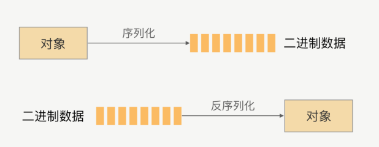
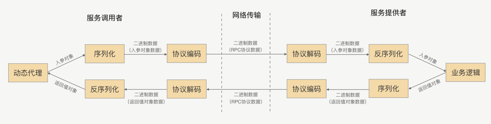

# 序列化
## 1. 为什么需要序列化

1. 网络传输的数据必须是二进制数据
2. java中的对象(网络中交互数据), 是不能直接在网络中传输

所以我们需要将需要在网络传输的对象转化为可传输的二进制, 并且这种转换算法是可逆的

**总结来说**, 序列化就是将对象转换成二进制数据的过程，而反序列就是反过来将二进制转换
为对象的过程

## 2. 序列化在RPC中的应用

### 2.1 RPC通信流程图

